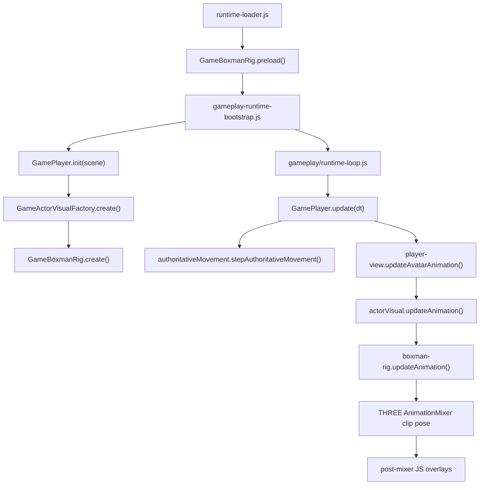

# Character Animation And Motion Deep Dive

This is a full audit of the current character stack as it exists in the repo right now.

Method:

- I read the live code path end to end.
- I inspected `public/assets/models/boxman.glb` directly with local scripts, not just by reading the wrapper code.
- I compared the runtime path, the asset data, the collision path, and the networked remote path.

The short version is:

- the character is a Blender-exported skinned mesh with one skeleton, 14 joints, and 36 clips
- every clip animates every joint on translation, rotation, and scale
- the live runtime does not use additive animation tracks from the asset
- instead, the runtime mixes a full clip first, then mutates a subset of bones and mount nodes in JavaScript
- the current house of cards mostly lives in the order of those post-mixer mutations

## 1. The live file map

These are the files that actually matter to the current character animation and motion system.

Live path:

- `js/app/runtime-loader.js`
- `js/runtime/gameplay-runtime-bootstrap.js`
- `gameplay/runtime-loop.js`
- `js/actors/player.js`
- `js/actors/player-view.js`
- `js/actors/player-world.js`
- `js/actors/player-status.js`
- `shared/authoritative-movement.js`
- `shared/entity-constants.js`
- `shared/entity-points.js`
- `js/presentation/actor-visual-factory.js`
- `js/actors/hitbox-factory.js`
- `js/actors/boxman-rig.js`
- `js/actors/boxman-directional-locomotion.js`
- `js/domain/weapons/visuals.js`
- `shared/gameplay-tuning.js`
- `js/world/world.js`
- `js/net/remote-entities.js`
- `js/net/remote-sync.js`

Asset and authoring side:

- `public/assets/models/boxman.glb`
- `scripts/blender/export_gltf.py`
- `docs/blender-asset-pipeline.md`

Repo noise / legacy / not on the live path:

- `js/actors/boxman-strafe.js`
- `js/actors/boxman-backpedal.js`
- `js/presentation/weapon-presentation.js`
- `js/actors/boxman-rig 2.js`
- `tests/actors/boxman-rig.test 2.js`

That last group is important. It means the repo currently contains more than one mental model for how the character should be posed, but only one of them is actually active in gameplay.

## 2. Runtime ownership chain

The live path is:



That last step, `post-mixer JS overlays`, is where almost all brittleness lives.

## 3. The raw asset: what Boxman actually is

Direct asset inspection of `public/assets/models/boxman.glb` shows:

- 1 scene
- 16 nodes total
- 1 mesh
- 1 skin
- 14 joints in the skin
- 36 animation clips

The bone tree is:

```text
Armature
  game_man
  root
    butt_bone
      body_IK
        arm_upper.L
          arm_lower.L
        body_lower
          body_upper
            head
        arm_upper.R
          arm_lower.R
        leg_upper.R
          leg_lower.R
        leg_upper.L
          leg_lower.L
```

### Important hierarchy surprise

The arms are not children of `body_upper`.

They are siblings of `body_lower` under `body_IK`.

That means:

- rotating `body_upper` does not naturally carry the arms
- rotating `body_lower` does not naturally carry the arms either
- arm aiming and torso facing are therefore more separate than they look at first glance

This is a major reason the system feels layered instead of cohesive.

### Runtime normalization

When the rig is created:

- the cloned scene is scaled so the mesh height matches the shared gameplay avatar dimensions
- the mesh is translated so the feet sit on `y = 0`
- `modelRoot.rotation.y` is initialized to `Math.PI`

That `Math.PI` matters. It means the raw Blender-exported forward is turned 180 degrees before gameplay-facing math is layered on top.

## 4. Every clip in the asset

The asset contains these clips, with raw durations from the GLB:

```text
close_door_sitting_left   0.7500  repeat  asset-only
close_door_sitting_right  0.7500  repeat  asset-only
close_door_standing_left  0.8333  repeat  asset-only
close_door_standing_right 0.8333  repeat  asset-only
driving                   0.2083  repeat  asset-only
drop_idle                 0.5000  once    live
drop_running              0.2500  once    live
drop_running_roll         0.5417  once    live
enter_airplane_left       1.1667  repeat  asset-only
enter_airplane_right      1.1667  repeat  asset-only
falling                   0.8333  repeat  live
idle                      0.8333  repeat  live
idle_shoot                0.8333  repeat  asset-only
jump_idle                 0.5000  once    live
jump_running              0.7500  once    live
open_door_standing_left   0.5833  repeat  asset-only
open_door_standing_right  0.5833  repeat  asset-only
reset                     0.2083  repeat  asset-only
rotate_left               0.6667  repeat  live
rotate_right              0.6667  repeat  live
run                       0.6250  repeat  live
run_shoot                 0.6250  repeat  asset-only
sit_down_left             0.5833  repeat  asset-only
sit_down_right            0.5833  repeat  asset-only
sitting                   0.5000  repeat  asset-only
sitting_shift_left        0.5000  repeat  asset-only
sitting_shift_right       0.5000  repeat  asset-only
sprint                    0.4167  repeat  live
stand_up_left             0.5833  repeat  asset-only
stand_up_right            0.5833  repeat  asset-only
start_back_left           0.4167  once    prepared-not-selected
start_back_right          0.4167  once    prepared-not-selected
start_forward             0.4167  once    live
start_left                0.4167  once    live
start_right               0.4167  once    live
stop                      0.6667  once    live
```

Meaning of the status column:

- `live`: current gameplay can actually select it
- `prepared-not-selected`: the rig sets loop mode for it, but `selectClip()` never picks it
- `asset-only`: exists in the GLB but is not part of the current gameplay path

### The most important clip fact

Every one of these 36 clips keys the same 14 joints, and keys all three channels:

- translation
- rotation
- scale

So the asset gives you full-body poses, not isolated upper-body layers.

That is why the runtime keeps having to do things like:

- pose a full clip
- then overwrite the right arm
- then add aim on top
- then counter-rotate the weapon
- then add recoil

There is no partial source clip protecting the arm from the rest of the body.

## 5. Coordinate systems and axis conventions

You need to think in four separate spaces.

### 5.1 World/gameplay space

This is the gameplay truth used by movement and camera math.

- `+Y` is up
- `+X` is world right
- `+Z` is world backward when `yaw = 0`
- `yaw = 0` means the player faces world `-Z`
- positive yaw turns left
- negative yaw turns right
- positive local camera `pitch` means look up
- negative local camera `pitch` means look down

That comes straight from movement and camera code:

- forward = `(-sin(yaw), 0, -cos(yaw))`
- right = `(cos(yaw), 0, -sin(yaw))`

One subtle transport wrinkle:

- local camera/view code treats positive pitch as up
- the network aim-forward payload negates pitch when turning it into a 3D vector

So "positive pitch" is consistent inside the local animation and camera code, but the serialized aim vector flips that sign at the transport boundary.

### 5.2 Raw GLB root space

The raw `root` bone in the GLB is basically canonical:

- `+X` right
- `+Y` up
- `+Z` forward in asset space

The runtime then rotates the whole `modelRoot` by `Math.PI`, so raw asset forward is flipped to match gameplay-facing forward.

### 5.3 Actor root vs rig model root

There are two yaw layers before you even get to torso and arm overlays.

Outer layer:

- `actorVisual.root.rotation.y = player yaw`

Inner layer:

- `rig.modelRoot.rotation.y = modelBaseYaw` which starts at `Math.PI`
- then directional locomotion or manual roll adds more yaw to `modelRoot`

So the final visible facing is:

- actor root yaw
- plus `modelBaseYaw`
- plus directional facing yaw or manual roll yaw

That nested yaw stack is one of the main reasons the system is hard to reason about by feel.

### 5.4 Major bone local axes in the bind pose

These are the practical local bases after the current import and normalization.

Torso chain:

- `body_lower`, `body_upper`, `head`
- local `+X` points character-right
- local `+Y` points up
- local `+Z` points forward

Intermediate skeleton pivot:

- `butt_bone` and `body_IK`
- these are rotated roughly `-90` degrees around local X in the bind pose
- local `+Y` points toward world `-Z`
- local `+Z` points toward world `+Y`

Arms and legs:

- both upper arms and both upper legs have very similar local bases
- local `+X` points to world `+X`
- local `+Y` points down the limb
- local `+Z` points mostly backward

This means the practical limb controls are:

- local `X` rotation is the main forward/back swing axis
- local `Y` rotation is mostly twist
- local `Z` rotation is the main side-sweep axis

### 5.5 Practical sign behavior on the live rig

Because the arm bases are not mirrored, the same signed rotation does not mean the same world motion on both sides.

Examples from direct bind-pose perturbation:

- `arm_upper.R.rotation.x += 10deg` moves the elbow slightly up and strongly backward in `Z`
- `arm_upper.R.rotation.y += 10deg` mostly twists in place and barely moves the elbow
- `arm_upper.R.rotation.z += 10deg` moves the elbow strongly toward more negative `X`

For the right arm, that last one is outward to the character's right.

For the left arm, the same local `+Z` value pulls the elbow back toward center instead of outward.

So a hard-coded `rotation.z += value` is not "open both elbows equally." It produces side-specific world results.

That is why right-arm-only procedural logic has been easier to keep under control than trying to apply mirrored rules blindly.

## 6. Which joints the live runtime actually controls

Clip mixer controls all animated bones first.

After that, the live runtime directly mutates these nodes:

Always or often touched procedurally:

- `rig.modelRoot.rotation.y`
- `rig.bodyLower.rotation.x`
- `rig.bodyLower.rotation.y`
- `rig.bodyUpper.rotation.x`
- `rig.bodyUpper.rotation.y`
- `rig.bodyUpper.rotation.z`
- `rig.headBone.rotation.y`
- `rig.armUpperR.rotation.x`
- `rig.armUpperR.rotation.y`
- `rig.armUpperR.rotation.z`
- `rig.armLowerR.rotation.x`
- `rig.armLowerR.rotation.y`
- `rig.armLowerR.rotation.z`
- `rig.weaponRoot.position.x`
- `rig.weaponRoot.position.z`
- `rig.weaponRoot.rotation.y`

Mounted, but not procedurally posed every frame:

- `throwableRoot` on `armLowerL`
- `weaponRoot` on `armLowerR`
- `muzzleAnchor`
- `eyeAnchor`
- `coreAnchor`
- `throwableOriginAnchor`

Mostly clip-driven right now:

- `armUpperL`
- `armLowerL`
- `legUpperL`
- `legUpperR`
- `legLowerL`
- `legLowerR`

This is the live truth:

- the current runtime is not a full procedural body system
- it is a full-body clip system with a procedural torso-facing layer and a heavily overridden right arm

## 7. End-to-end frame flow for the local player

### 7.1 Boot

`runtime-loader.js` preloads `GameBoxmanRig` before gameplay startup.

Then `gameplay-runtime-bootstrap.js`:

- creates the scene and camera
- creates the world
- initializes the player
- creates the actor visual through `GameActorVisualFactory`

### 7.2 Local motion truth

`GamePlayer.update(dt)` is where local truth advances.

It builds a motion state and passes it into `shared/authoritative-movement.stepAuthoritativeMovement()`.

That function owns:

- horizontal movement
- sprint vs jog speed cap
- ADS movement slowdown
- jump start
- jump hold
- jump release cut
- gravity
- landing on boxes or terrain
- ceiling collision

So the physics truth comes first, not animation.

### 7.3 Player visual update

After movement is stepped, `GamePlayer.update()` does:

1. `updateAvatarPose()`
2. `updateAvatarAnimation()`
3. `applyUnifiedGunOffsets()`
4. `updateCameraFromPlayer()`

That means:

- world transform is set before animation update
- clip and rig overlays happen before camera finalization
- camera recoil is partly separate from rig recoil

## 8. Collision and body mechanics

### 8.1 Movement collision

Movement collision is not skeletal.

It is:

- a horizontal radius from `PLAYER_RADIUS`
- a vertical height from `PLAYER_HEIGHT`
- XZ overlap tests against cached world `Box3`s

`shared/authoritative-movement.js` and `js/actors/player-world.js` both use this same basic model:

- test X movement first
- then test Z movement
- test vertical landing surfaces separately
- test ceilings separately

This means the player is physically a gameplay cylinder/capsule approximation, not a bone-driven character volume.

### 8.2 Combat hitboxes

Combat hitboxes are separate from movement collision.

They come from:

- `shared/entity-constants.js`
- `shared/entity-points.js`
- `js/actors/hitbox-factory.js`
- `js/presentation/actor-visual-factory.js`

There are:

- one body box
- one head box
- and on roll, the head box disappears and the body box shrinks

Important mismatch:

- rolling changes combat hitboxes
- rolling does not change the movement collision cylinder in `stepAuthoritativeMovement()`

So roll is:

- a visual state
- a combat hitbox state
- but not a different locomotion collider

If somebody expects roll to squeeze through smaller geometry, that is not how the current system works.

### 8.3 World collision source

`GameWorld` builds the collision boxes from:

- authored blocks
- ramps
- decor meshes
- authored cylinder and dome colliders compiled into boxes
- terrain sampler height queries

`player-world.js` just caches those boxes and exposes helper queries to the player.

## 9. Clip selection and playback rules

The live gameplay clip selector is in `boxman-rig.js`.

### 9.1 Looping rules

Loop once:

- `jump_idle`
- `jump_running`
- `stop`
- `start_forward`
- `start_left`
- `start_right`
- `start_back_left`
- `start_back_right`
- `drop_idle`
- `drop_running`
- `drop_running_roll`

Loop repeat:

- everything else

### 9.2 Special playback behavior

- backward `run` and `sprint` can play reversed
- fast backpedal speeds up reversed `run`
- `rotate_left` and `rotate_right` playback speed scales with turn rate
- jump clips skip the crouch lead-in by starting at 24 percent through the clip

### 9.3 Active gameplay selection logic

The live selector chooses among:

- `idle`
- `run`
- `sprint`
- `jump_idle`
- `jump_running`
- `falling`
- `drop_idle`
- `drop_running`
- `drop_running_roll`
- `rotate_left`
- `rotate_right`
- `start_forward`
- `start_left`
- `start_right`
- `stop`

Important clip facts:

- `start_back_left` and `start_back_right` are prepared but never selected
- `idle_shoot` and `run_shoot` are in the asset but not part of the current gameplay path
- reload clips do not exist in the live character path

## 10. Directional locomotion: the live torso-facing layer

`js/actors/boxman-directional-locomotion.js` is the live movement-facing system.

It does three big things:

1. convert movement inputs into a local move intent
2. decide how much the model should visually face into that movement
3. add torso/head counter-yaw and idle turn behavior

### 10.1 Move intent

Inputs become:

- `forwardAxis`
- `rightAxis`
- `angle`
- `sideSign`
- flags like `pureForward`, `pureStrafe`, `pureBackpedal`, `diagonal`

This is camera-relative input interpretation, not world-relative animation logic.

### 10.2 Facing yaw

The rig computes a `targetFacingYaw` from the move intent.

That yaw:

- turns the inner `modelRoot`
- not the outer actor root

Then the torso and head counter-twist back:

- `bodyLowerAimYaw = -(facingYaw * 0.2)`
- `bodyUpperAimYaw = -(facingYaw * 0.25)`
- `headAimYaw = -(facingYaw * 0.35)`

So the visual recipe is:

- whole body faces somewhat into travel
- torso and head resist that turn to preserve a combat read

### 10.3 Standing turn system

When grounded and almost still:

- small turn rate uses an idle turn pose
- medium and large turn rate uses `rotate_left` / `rotate_right`
- enough turn wipe can trigger `start_left` / `start_right`

### 10.4 Stop settle

When movement stops after a fast forward run:

- a snapshot of the last directional pose is stored
- the pose is blended out over a short settle window

That is why stop does not instantly snap to neutral.

### 10.5 What this system does not do anymore

It does not procedurally animate the legs or left arm.

There are older repo files for that:

- `boxman-strafe.js`
- `boxman-backpedal.js`

But they are not imported into the live rig.

Current live directional locomotion only touches:

- `modelRoot`
- `bodyLower`
- `bodyUpper`
- `headBone`

That is a very important simplification.

## 11. The right arm stack: this is the fragile core

The right arm is the most layered part of the whole character.

The post-mixer order is:

1. full clip pose from the `AnimationMixer`
2. `modelRoot` yaw reset / directional facing
3. right-arm base override for certain clips
4. idle aim pitch/yaw offset
5. weapon root yaw compensation
6. fire recoil pose
7. recoil decay state update

That order matters more than the individual numbers.

### 11.1 Right-arm lock

For these clips:

- `rotate_left`
- `rotate_right`
- `start_left`
- `start_right`
- `jump_idle`
- `jump_running`
- `falling`
- `drop_idle`
- `drop_running`

the live rig replaces the clip's right arm with a fixed base pose:

- upper arm base: `x = 21.02deg`, `y = -7.92deg`, `z = 11.86deg`
- lower arm base: `x = -33.6deg`, `y = 0`, `z = 0`
- then both bones get a neutral aim pitch bias baked in

That means the arm lock is not currently side-dependent.

If the arm appears to "reach across" or "reach out" more on one side, that is currently coming from:

- actor root yaw
- inner model root yaw
- torso counter-yaw
- right-arm local yaw overlays

not from an explicit left-arm-vs-right-arm shoulder branch.

### 11.2 Run right-arm override

On `run`:

- the right arm is first reset to the same locked base pose
- then a small procedural swing is added on top
- that swing is suppressed if fire recoil is active

This is why the run clip's authored right arm does not really survive in the final picture.

### 11.3 Idle aim

`applyIdleAimPose()` adds:

- pitch to upper and lower right arm
- yaw to upper and lower right arm

Pitch target:

- neutral pitch bias of `28deg`
- plus half of camera pitch response
- clamped to `45deg`

Yaw target:

- derived from directional locomotion `facingYaw`
- not from raw mouse yaw directly

That is a crucial point.

The right-arm yaw layer is tied to how the character is visually facing into locomotion, not a simple "mouse moved left/right, rotate arm yaw" rule.

### 11.4 Weapon yaw compensation

`applyWeaponOrientationCompensation()` resets `weaponRoot.rotation` to its base value every frame, then only adds extra yaw when `currentYaw > 0`.

So weapon yaw compensation is intentionally asymmetrical.

That means:

- the gun counter-rotates only on the outward-opening side
- the rig does not do a symmetric gun yaw correction for both directions

### 11.5 Fire recoil

The recoil state object supports:

- `weaponKick`
- `shoulderPitch`
- `shoulderYaw`
- `shoulderRoll`
- `lowerArmPitch`

But the current fire trigger only meaningfully uses:

- `weaponKick`
- `lowerArmPitch`
- `side`
- recovery scales

The local fire action currently passes:

- `shoulderPitch: 0`
- `shoulderYaw: 0`
- `shoulderRoll: 0`

So the live recoil effect on the rig is much narrower than the state structure suggests.

In practice:

- camera carries most recoil feel
- weapon root gets positional kick
- lower right arm gets extra pitch

The shoulder recoil fields are present, but mostly dormant on the live path.

## 12. Weapon and throwable mounting

The character mesh from Blender does not include finished weapon meshes.

Current weapon visuals are procedural.

### 12.1 Live bone attachment

The rig resolves actual animated bones from the `SkinnedMesh.skeleton.bones` array first, then falls back to name lookup.

Resolved bones:

- `body_upper`
- `body_lower`
- `head`
- `arm_upperL` / `arm_upper.L`
- `arm_upperR` / `arm_upper.R`
- `arm_lowerL` / `arm_lower.L`
- `arm_lowerR` / `arm_lower.R`
- `leg_upperL` / `leg_upper.L`
- `leg_upperR` / `leg_upper.R`
- `leg_lowerL` / `leg_lower.L`
- `leg_lowerR` / `leg_lower.R`

### 12.2 Right-hand weapon mount

`weaponRoot` is parented to `armLowerR`.

Its base local transform is:

- position: `x -0.04`, `y 0.65`, `z -0.06`
- rotation: `x 0.08 - 10deg`, `y 0.22`, `z 0`

Then the actual weapon model is positioned inside `weaponRoot` using:

- per-weapon mount offsets
- per-weapon handle-back zone
- fixed extra rotation:
  - `+90deg - 15deg` on X
  - `0` on Y
  - `180deg` on Z

### 12.3 Left-hand throwable mount

`throwableRoot` is parented to `armLowerL`.

It reuses the same mount values as the pistol/weapon hand mount.

### 12.4 Muzzle and throw origin

Anchors:

- `coreAnchor` on `bodyLower`
- `eyeAnchor` on `head`
- `throwableOriginAnchor` on `throwableRoot`
- `muzzleAnchor` on `weaponModel`

These are the spatial outputs used by:

- hitscan origin fallback
- throwable launch origin
- remote sync helpers
- combat feedback helpers

### 12.5 There is no rig-owned muzzle flash mesh

`setMuzzleVisible()` in `boxman-rig.js` is effectively a no-op and returns `false`.

So the rig has:

- a muzzle anchor
- but not a real rig-owned muzzle flash visual that is toggled on and off

That is another sign of a partially migrated presentation system.

## 13. Reload, ADS, hook, choke: what the rig is told vs what it actually uses

`player-view.js` builds and passes an `animState` with fields like:

- `reloading`
- `reloadPct`
- `reloadPhase`
- `reloadPhasePct`
- `adsActive`
- `hooked`
- `choked`

But the current `boxman-rig.js` does not read those fields.

So the live truth is:

- reload presentation is computed
- ADS status is computed
- hook/choke status is computed
- but the rig mostly ignores them

That means the interface between `player-view` and `boxman-rig` currently advertises more animation capability than the rig is actually consuming.

This is one of the clearest sources of false confidence in the system.

## 14. There is a second weapon-presentation system in the repo, but it is not live

`js/presentation/weapon-presentation.js` contains a much more ambitious pose system:

- right aim pose by hold class
- left support-hand pose
- reload overlay
- hold profiles for one-hand and two-hand guns

But nothing on the live path calls:

- `GameWeaponPresentation.applyBasePose()`
- `GameWeaponPresentation.applyReloadOverlay()`

So right now that file is not part of the active gameplay pose stack.

This matters because it is easy to read that file and assume:

- reload arm posing exists
- support-hand posing exists
- two-hand precision support exists

But those features are not actually driving the live Boxman rig.

## 15. Remote actors use the same rig, but a different state feed

Remote actors are created through the same `GameActorVisualFactory`, so they share:

- the same GLB
- the same `GameBoxmanRig`
- the same hitbox factory

But they are driven by interpolated network state in `js/net/remote-sync.js`.

Remote animation input includes:

- interpolated yaw
- interpolated pitch
- interpolated movement flags
- interpolated speed norm
- jump and roll trigger edges

Important mismatch:

- local animation speed uses `effectiveRunSpeedForWeapon(currentWeaponId)`
- remote animation currently multiplies `moveSpeedNorm * 14`

So remote actors are not using the same weapon-adjusted speed scale as the local player.

That is a real parity drift point.

## 16. What is actually brittle right now

This is the brittleness map, in plain terms.

### 16.1 Every source clip is full-body

Because every clip keys every joint on TRS, the runtime has to keep overriding bones after the mixer.

### 16.2 There are too many yaw layers

Visible facing is composed from:

- actor root yaw
- `modelBaseYaw`
- directional `facingYaw`
- torso counter-yaw
- head yaw
- right-arm yaw
- optional weapon root yaw compensation

When something looks wrong, there is no single obvious owner.

### 16.3 The right arm is not one system

The right arm is the combined result of:

- clip
- fixed arm lock
- run swing
- idle aim
- gun counter-rotation
- lower-arm recoil

That means every new behavior risks fighting the order of operations.

### 16.4 Left and right arm systems are not symmetric

The live runtime heavily manages the right arm.

The left arm is mostly:

- whatever the clip says
- plus a throwable mount

That asymmetry is stable only as long as the clips keep cooperating.

### 16.5 Repo drift is real

The repo contains:

- unused pose modules
- unused helper fields
- duplicate backup files
- a dead weapon-presentation layer
- animation state fields that are passed but ignored

That makes it harder to know which system is authoritative.

### 16.6 Roll is split across three models

Roll currently means:

- a clip and pose state
- a combat hitbox state
- a timed action lock

But not:

- a special movement collider

That is a conceptual split, not a unified mechanic.

### 16.7 The rig stores unused or underused state

Examples:

- `upperBodyPivot`
- `armUpperRBasePos`
- `resolveBoneStickerLocal()`
- fire recoil shoulder fields on the live path

Those are signs of incomplete migrations.

## 17. What the system is actually good at right now

Despite the house-of-cards feeling, the current stack does some things well.

### 17.1 It keeps gameplay authoritative

Movement, collision, and camera truth are not delegated to animation.

That is good.

### 17.2 It uses the GLB as a full-body motion source, then corrects only the pieces that matter for combat readability

That is a valid pattern.

### 17.3 The right-arm lock gives you combat stability through jump, turn, and landing clips

That is why the gun hand can remain legible while the rest of the body uses authored animation.

### 17.4 The directional locomotion layer is currently much simpler than older experimental pose systems

It only manages:

- inner body facing
- torso
- head

That simplification is good and should probably be preserved.

## 18. If you want to change specific things, here is where to go

If you want to change clip choice:

- `boxman-rig.js`
- `selectClip()`
- `resolveClipPlayback()`

If you want to change how the body visually faces into movement:

- `boxman-directional-locomotion.js`

If you want to change stop behavior:

- `beginStopDirectionalSettle()`
- `stopDirectionalSettleWeight()`
- `applyStopSettleRightArmRecoveryPose()`

If you want to change jump/air right-arm stability:

- `clipUsesLockedRightArmAimBasePose()`
- `applyLockedRightArmAimBasePose()`

If you want to change right-arm aim response:

- `idleAimTargetPitch()`
- `idleAimTargetYaw()`
- `applyIdleAimPose()`

If you want to change recoil feel:

- local camera recoil: `player-view.js`
- rig recoil state and lower arm kick: `boxman-rig.js`
- weapon tuning numbers: `shared/gameplay-tuning.js`

If you want to change where guns sit in the hand:

- `pistolMountConfig()`
- `throwableMountConfig()`
- `js/domain/weapons/visuals.js`

If you want to change collision:

- `shared/authoritative-movement.js`
- `js/actors/player-world.js`
- `js/world/world.js`

If you want to change combat hitboxes:

- `shared/entity-constants.js`
- `shared/entity-points.js`
- `js/presentation/actor-visual-factory.js`
- `js/actors/hitbox-factory.js`

If you want remote characters to match local characters better:

- `js/net/remote-sync.js`
- `js/net/remote-entities.js`

## 19. The two most important mental models to keep

### Mental model 1: the clip is not the final pose

The clip is just the first draft.

The final pose is:

- clip
- plus movement-facing torso/head edits
- plus right-arm reset
- plus aim offsets
- plus weapon counter-rotation
- plus recoil

### Mental model 2: gameplay owns motion, animation decorates it

Movement and collision truth come from:

- `stepAuthoritativeMovement()`

Animation does not decide where the player is.

Animation only decides how that already-decided state is presented.

That distinction is healthy. The brittle part is not that gameplay owns motion. The brittle part is how many presentation layers stack on the same few arm and yaw channels afterward.

## 20. My bottom-line read of the current system

The current system is not random. It has a consistent shape:

- full-body authored clip base
- minimal live torso-facing layer
- heavily managed right arm for combat readability
- procedural weapon mount
- separate gameplay collider and combat hitbox systems

The reason it feels like a house of cards is not because the whole thing is wrong.

It feels brittle because:

- there are several dead or half-dead pose systems still in the repo
- the live rig interface exposes more state than the rig consumes
- the same final arm is being touched by too many post-mixer rules
- there are many nested coordinate spaces and yaw layers

If I were manipulating the character after this audit, I would treat the system as having three stable centers of truth:

1. `shared/authoritative-movement.js` for physical truth
2. `boxman-directional-locomotion.js` for torso-facing truth
3. `boxman-rig.js` right-arm post-mixer order for weapon/aim truth

Everything else should be treated as either a consumer, a mount helper, or legacy noise until proven otherwise.
