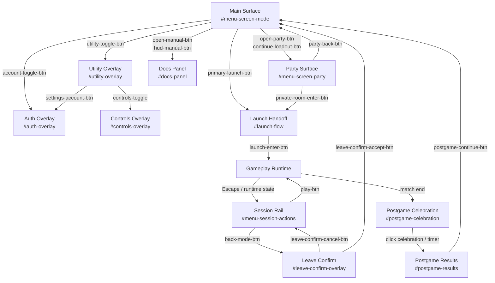

# Menu Click Path Map

This is the current click graph for the live menu shell in `/Users/gguthrie/Desktop/code bs/minecraft-fps/index.html` and the controller/runtime code that is actually instantiated by `js/app/menu-modules.js`.

Two important constraints:

- The live menu graph is driven by `js/app/lobby-controller.js`, `js/app/menu-shell.js`, `js/app/menu-loadout.js`, `js/app/auth-ui.js`, `js/app/input-bindings-ui.js`, `js/app/runtime-session.js`, and `js/runtime/docs.js`.
- Older split-out lobby helper files were deleted during release cleanup. If a menu path is not described through the live modules above, it is not part of the current shell.

## Surface Graph

## Static Button Inventory

| Surface | Button | Click path | Notes |
| --- | --- | --- | --- |
| Global HUD | `hud-manual-btn` | Toggles `#docs-panel` through `GameRuntimeLoader.toggleDocs()` | Works from the shell and from gameplay HUD. |
| Main header | `menu-return-btn` | Calls `GameSession.resumeGameplay()` if shown | Currently suppressed by the session rail in paused and retryable states, so it is effectively dead in normal pause flow. |
| Main header | `party-back-btn` | Sets `activeSurface = 'main'` | Only visible on the party surface outside pause. |
| Main header | `account-toggle-btn` | Opens or closes `#auth-overlay` | Hidden on the home surface once logged in. |
| Main header | `menu-party-id-btn` | Copies current player or guest ID | No navigation change. Status only. |
| Main header | `join-party-trigger-btn` | Toggles `#join-party-popover` and focuses `#party-id-input` when opening | Home-only entry into friend-party join flow. |
| Join popover | `join-party-btn` | Calls `session.runPartyAction('join', { targetId })` and closes the popover | No automatic surface change. |
| Main header | `continue-loadout-btn` | If no private room exists, creates one and then switches to `#menu-screen-party`; otherwise just opens the party surface | Label becomes `Open Room` when a room already exists. |
| Main header | `open-party-btn` | Opens the party surface; during pause it toggles between the paused main/party subpanels | This is the primary explicit route into the party screen. |
| Main header | `utility-toggle-btn` | Opens or closes `#utility-overlay` | Outside click and `Escape` also close the overlay. |
| Utility overlay | `utility-close-btn` | Closes `#utility-overlay` | Inline close. |
| Utility overlay | `settings-account-btn` | Closes utility, then programmatically clicks `account-toggle-btn` | Proxy into the auth/profile surface. |
| Utility overlay | `open-manual-btn` | Toggles `#docs-panel` through lazy docs runtime loading | Does not close utility first. |
| Utility overlay | `controls-toggle` | Opens `#controls-overlay` | Modal-managed overlay. |
| Utility overlay | `sound-toggle-btn` | Toggles mute only after gameplay runtime has been loaded | The live handler is in `js/runtime/gameplay-controls.js`, not the menu shell. |
| Session rail | `play-btn` | Attempts pointer lock and re-enters gameplay | Label changes between `ENTER MATCH` and `RESUME MATCH`. |
| Session rail | `back-mode-btn` | Opens `#leave-confirm-overlay` when the session is resumable; otherwise returns straight to menu | The real leave flow starts here, not from the hidden header return button. |
| Main surface | `primary-launch-btn` | Launches the selected quick-match mode | `sandbox` launches Offline Sandbox locally; `ffa` and `tdm` request matchmaking first. |
| Main surface | `game-modes-toggle-btn` | Opens or closes `#play-mode-options` | Local UI only. |
| Main surface | `play-mode-ffa-btn` | Sets selected mode to `ffa` and closes mode list | No navigation change. |
| Main surface | `play-mode-tdm-btn` | Sets selected mode to `tdm` and closes mode list | No navigation change. |
| Main surface | `sandbox-mode-btn` | Sets selected mode to `sandbox` and closes mode list | No navigation change until launch. |
| Party surface | `create-private-room-btn` | Calls `session.createPrivateRoom()` and stays on the party surface | Optionally seeds Team Death Match from the selected quick-match mode. |
| Party surface | `join-private-room-btn` | Calls `session.joinPrivateRoom(roomCode)` and stays on the party surface | Enter on `#private-room-input` triggers the same path. |
| Party surface | `copy-room-code-btn` | Copies the room code from `#room-share-code` | No navigation change. |
| Party surface | `private-room-mode-ffa-btn` | Calls `session.setPrivateRoomMode('ffa')` | Host-only. |
| Party surface | `private-room-mode-tdm-btn` | Calls `session.setPrivateRoomMode('tdm')` | Host-only. |
| Party surface | `private-room-randomize-btn` | Calls `session.randomizePrivateRoomTeams()` | Host-only. |
| Party surface | `private-room-start-btn` | Calls `session.startPrivateRoomMatch()` | Host-only, lobby-phase only. |
| Party surface | `private-room-enter-btn` | Launches the active room through `launchModeById('single_cloudflare', { roomId, gameMode })` | This is the party-to-gameplay handoff. |
| Party surface | `party-join-lock-btn` | Toggles party join lock through `session.runPartyAction('lock', ...)` | Leader-only. |
| Party surface | `leave-party-btn` | Calls `session.runPartyAction('leave', {})` | No forced surface change. |
| Party surface | `add-friend-btn` | Calls `session.performFriendAction('add', targetUserId, ...)` | Enter on `#friend-id-input` triggers the same path. |
| Party surface | `friends-filter-joinable-btn` | Sets local filter to `joinable` | No network call. |
| Party surface | `friends-filter-online-btn` | Sets local filter to `online` | No network call. |
| Party surface | `friends-filter-all-btn` | Sets local filter to `all` | No network call. |
| Party surface | `refresh-friends-btn` | Calls `session.refreshFriendsState(false)` | Network refresh of the inline friends preview. |
| Loadout band | `loadout-collapse-btn` | Collapses the expanded loadout band into the summary row | Pure local UI state. |
| Loadout band | `weapon-slot-summary` | Re-expands the loadout band | Pure local UI state. |
| Loadout band | `throwable-slot-summary` | Re-expands the loadout band | Pure local UI state. |
| Loadout band | `weapon-slot-primary` | Selects weapon slot 1 as the active assignment target | No surface change. |
| Loadout band | `weapon-slot-secondary` | Selects weapon slot 2 as the active assignment target | No surface change. |
| Leave confirm | `leave-confirm-cancel-btn` | Closes the leave-confirm overlay and keeps the current session state | Returns to the paused/session rail state. |
| Leave confirm | `leave-confirm-accept-btn` | Closes the overlay and calls `GameSession.returnToMenu()` | Returns to the menu shell. |
| Auth overlay | `auth-close-btn` | Closes `#auth-overlay` | Modal close. |
| Auth overlay | `auth-play-btn` | Validates username and 4-digit PIN, logs in, loads profile, and closes the overlay on success | Networked auth path. |
| Auth overlay | `auth-local-btn` | Switches to local guest mode and closes the overlay | No network call. |
| Auth overlay | `auth-logout-btn` | Logs out and leaves the auth overlay in logged-out state | Networked for real accounts, local-only for guest mode. |
| Docs panel | `docs-close-btn` | Closes `#docs-panel` | The rest of the docs navigation is generated at runtime. |
| Controls overlay | `controls-close-btn` | Closes `#controls-overlay` | Overlay click and `Escape` also close it. |
| Controls overlay | `controls-reset-btn` | Resets bindings to defaults | No surface change. |
| Launch handoff | `launch-enter-btn` | Calls `GameSession.enterGameplay(...)` | Only appears when the handoff is in a retryable ready state. |
| Postgame results | `postgame-continue-btn` | Completes postgame flow | Returns to menu for normal matches, or back to a resumable private-room shell if the session stays attached. |
| Stale overlay | `party-roster-close-btn` | No active click path in the current shell | `#party-roster-overlay` exists in HTML but no current controller opens it. |
| Stale overlay | `friends-close-btn` | No active click path in the current shell | `#friends-overlay` exists in HTML but no current controller opens it. |

## Dynamic Button Families

These buttons are created at runtime and are part of the real click graph even though they are not declared in `index.html`.

| Family | Created in | Click path |
| --- | --- | --- |
| `join-recent-btn` | `lobby-controller.js` | Writes the selected recent player ID back into `#party-id-input`. |
| `friend-preview-btn` in the live inline friends view | `lobby-controller.js` | One of `accept_invite`, `join`, or `invite` through `session.performFriendAction(...)`. |
| `weapon-choice-btn` | `menu-loadout.js` | Assigns the chosen weapon to the currently active slot and persists the loadout. |
| `throwable-cat-btn` | `menu-loadout.js` | Switches the active throwable category. |
| `throwable-choice-btn` | `menu-loadout.js` | Selects the throwable and persists the loadout. |
| `controls-bind-btn` | `input-bindings-ui.js` | Enters capture mode for a specific action and writes the new local keyboard binding. |
| `docs-tab` | `runtime/docs.js` | Switches the docs page between `briefing`, `controls`, `weapons`, `throwables`, and `tunables`. |
| `docs-subitem` | `runtime/docs.js` | Switches the selected weapon or throwable profile inside the docs panel. |
| `private-room-member-move` | `lobby-private-room-view.js` | Moves a private-room member between teams. |

## Dead Or Stale Paths

- `menu-return-btn` is bound but effectively shadowed by the session rail.
- `party-roster-overlay` and `friends-overlay` still exist in the DOM, but there is no active open path from the current menu shell.

## Coverage Snapshot

Current automated coverage hits only part of this graph:

- `tests/app/menu-click-paths.test.js` covers the main surface happy path, room creation entry, and paused shell state.
- `tests/app/menu-loadout.test.js` covers the loadout band and its generated choice buttons.
- `tests/app/input-bindings-ui.test.js` covers controls open, rebind, and reset.
- `tests/app/runtime-session.test.js` covers session rail and handoff state, but mostly at the state-transition level.
- `e2e/menu-shell.spec.js` and `e2e/social.spec.js` still exercise some top-level flows, but this map now excludes the deleted dev-overlay and duplicate launch-button path from the active shell.
